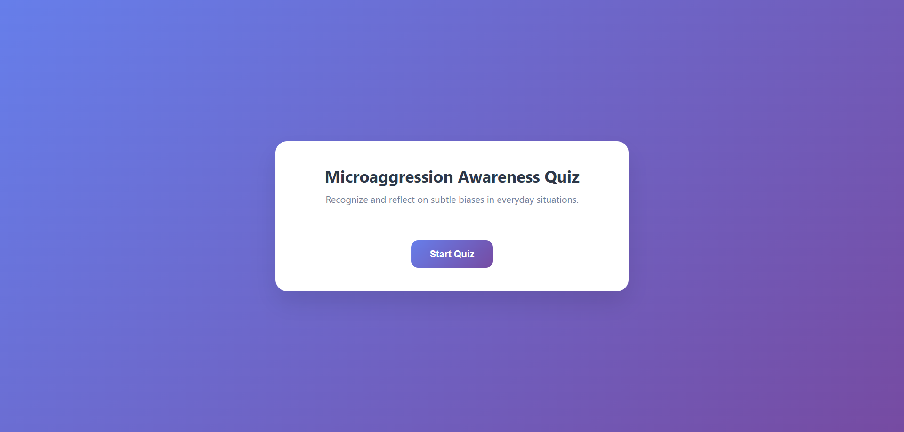
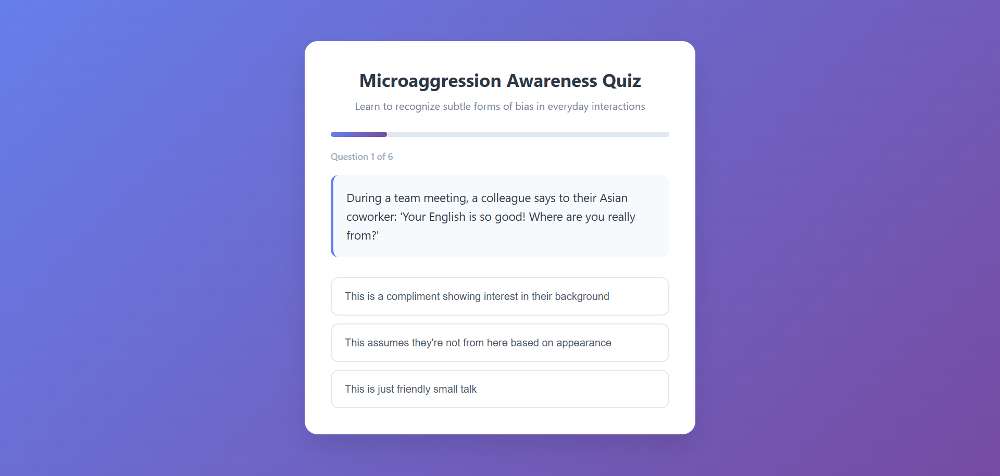
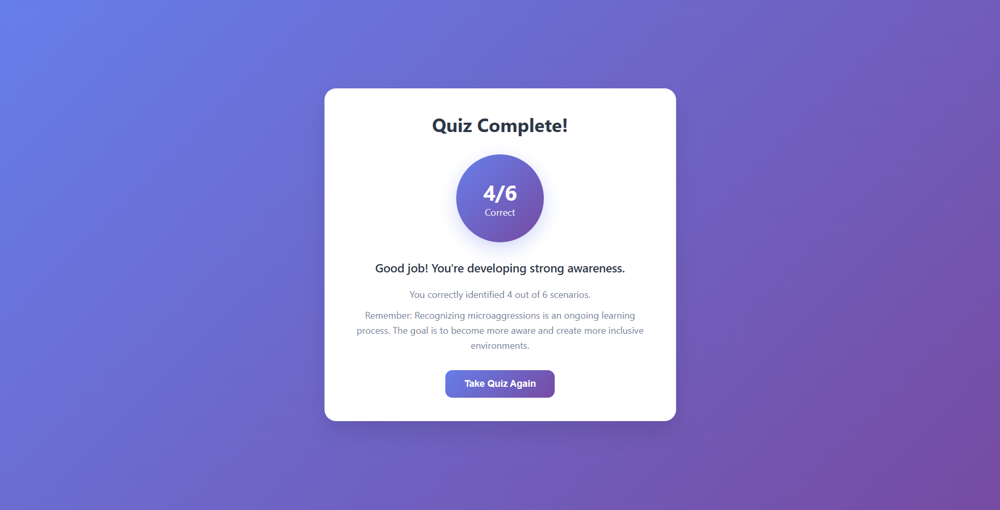

# 🧠 Microaggression Awareness Quiz App

An interactive React web app that helps users recognize and reflect on microaggressions — subtle and often unintentional biases in everyday interactions.

## 🎯 Purpose

This app is designed to promote **awareness**, **education**, and **reflection** around microaggressions related to race, gender, sexuality, and identity. By simulating real-life scenarios in quiz format, users are encouraged to better understand inclusive communication.

---

## 🚀 Live Demo

[🔗 Link to Live App](https://microaggression-quiz-app.vercel.app/)

---

## 🖼️ Features

- ✅ Clean, mobile-responsive UI with soft, accessible colors  
- ✅ Landing page with animated call-to-action  
- ✅ Scenario-based multiple choice questions  
- ✅ Immediate feedback with educational explanations  
- ✅ Result summary with personalized message  
- ✅ Replayable anytime to continue learning

---

## 🛠️ Built With

- ⚛️ [React](https://reactjs.org/)
- 💅 CSS (custom, no frameworks)
- 🎨 Responsive and modern layout

---

## 📷 Screenshots

### Landing page

### Quiz Page

### Result page

### 👥 Contributors
- [@dhruvsaini25](https://github.com/dhruvsaini25)
- [@pragyan2804](https://github.com/pragyan2804)
- [@Aditya-Mishra0](https://github.com/Aditya-Mishra0)
